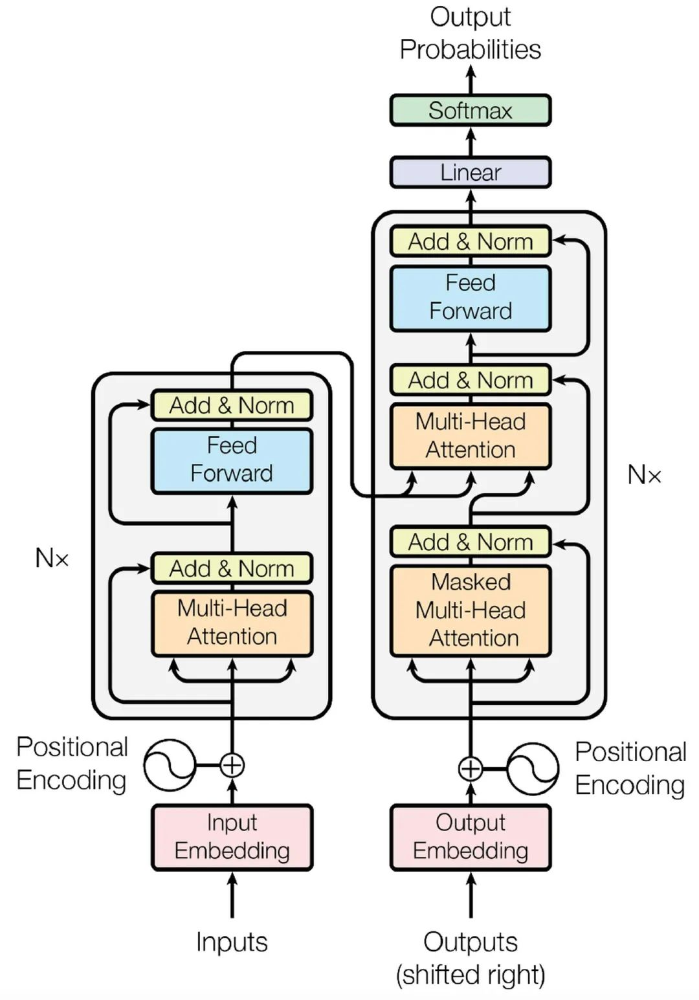
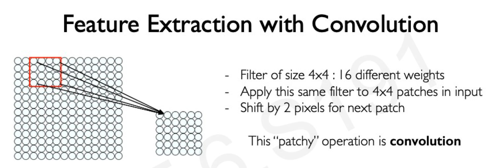

+++
title = 'Notes for MIT 6.S191'
date = 2024-05-01T21:52:19+08:00
draft = false
+++

## 1. Introduction to Deep Learning

- After watch one of Feifei Li and Geffery Hinton's video on Youtube, I start to gain interest in DeepLearning, then I found this MIT course online that is a very comprehensive introduction for the Deep Learning which perfect for beginners like myself. This blog post marks the beginning of my journey into the world of machine learning, serving as a collection for my course notes and insights from related materials.

## 2. Course Content

1. **Leture 1: Introductin**
    - The Perceptron
        1. Perceptron: Simplified
            
            * **Activation Functions** is to introduce **non-linearites** into the network
                * Sigmoid
                * Hyperbolic Tangent
                * Rectified Linear Unit(ReLU)
                * We can implement this graph on code very easily
            * **One perceptron**: Draws a line to separate data. binary classification.
            * **Multiple perceptrons** in layers: Can create complex curves and shapes to separate data
            * What does it do?
            Essentially, a perceptron learns a linear decision boundary that separates the input space into two regions, each corresponding to a different class.            
        2. **Forward Propagation/Forward Pass**:

             refers to the calculation and storage of intermediate variables (including outputs) for a neural network in order from the input to the output layer.


    - The Neural Networks
        1. Neural Network: 
            Stacking Perceptrons to form neural network
            
            * -> MLP: Multi Layer Perceptron
        2. **Loss**: 
            The **loss** of our network measures the cost incurred from incorrect 

            * Empirical Loss

                The empirical loss measures the total loss over our entire dataset. Also know as Objective function, Cost function, Empirical Risk
                $$
                J(W) = \frac{1}{n} \sum_{i=1}^{n} L(f(x_i;W),y_i)
                $$

            * Binary Cross Entropy Loos
                $$
                J(W) = - \frac{1}{n} \sum_{i=1}^{n} \log(f(x_i;W)) + (1-y_i) log(1-f(x_i;W))
                $$
                
            * Mean Squared Error Loss
                $$
                J(W) = \frac{1}{n} \sum_{i=1}^{n} (y_i - f(x_i;W))^2
                 $$

            3. **Loss Optimization**
                
                - $$
                    \begin{aligned}
                    W^* = \arg \mathop{min}\limits_{W} \frac{1}{n} \sum_{i=1}^{n} L(f(x_i;W),y_i)\\
                    W^* = \arg \mathop{min}\limits_{W} J(W)\\
                    \text {Where as: } W=\{W_0, W_1, ...\}
                    \end{aligned}
                $$

                - We want to **find** the network weights that achieve the **lowest loss**
                - Our loss is a function of the network weights
                - We can use gradient descent to find the weights that minimize the loss

            4. **Gradient Descent**

                1. Initialize weights randomly $\sim N(0,\sigma^2)$
                2. Loop until convergence
                3. &nbsp;&nbsp; Compute gradients, $ \frac{\partial J(W)}{\partial W}$
                4. &nbsp;&nbsp; Update weights: $ W \leftarrow W - \eta \frac{\partial J(W)}{\partial W}$
                5. Return weights

                - **Backpropagation**: 

                    Backpropagation is the application of gradient descent in deep learning, used to compute gradients of weights in neural networks. It employs the **chain rule** from calculus to efficiently propagate errors backwards, guiding updates to each layer's parameters. By calculating the partial derivatives of the loss function with respect to every weight, it determines how each weight should be adjusted to minimize the loss.


                - **Learning Rate**

                    Momentum or Adaptive Learning Rates: For improved convergence, incorporate momentum or adaptive learning rate techniques like Nesterov Accelerated Gradient (NAG), RMSprop, or Adam.

                - **Mini-Batch Gradient Descent**

                    Instead of using all data points at once, use a mini-batch of B data points to compute the gradient. This reduces the computational cost and improves convergence.
                    $$
                        \frac{\partial J(W)}{\partial W} = \frac{1}{B} \sum_{i=1}^{B} \frac{\partial J_k(W)}{\partial W}\\
                    $$
                    $$
                        \text {Then update weights: }W \leftarrow W - \eta \frac{\partial J(W)}{\partial W}
                    $$
                    - More accurate estimation of gradient
                    - Allow for larger learning rates
                    - Smoother convergence
                    - Fast training! Can parallelize computation and achieve significant speed increases on GPU's
                3. **Optimization Algorithm**
                    * SGD(Stochastic Gradient Descent)
                    * Adam
                    * Adadelta
                    * Adagrad
                    * RMSProp


            
        3. **Real World Technique** 
            1. Mini-batches
            2. **Fitting**
                * Underfitting: Model does not have capacity to fully learn the data
                * Ideal fit
                * Overfitting: Too complex, extra parameters, does not generalize well
            3. **Regularization**: Improve generalization of our model on unseen data
                1. **Dropout**
                    During training, randomly set some activations to 0
                    * Typically 'drop' 50% of activations in layer
                    * Forces network to not rely on any 1 node

                        

                2. **Early Stopping**

                    * Stop training before we have a chance to overfit
                    

2. **Leture 2: Deep Sequence Modeling**
    - I'm gonna write this note in a more practical way, and from my SDE perspective. Code is nessesary for me to understand the concept.
    - Recurrent Neural Networks(RNNs)
        - Many to One: Sentiment Classification
        - One to Many: Text Generation, Image Captioning
        - Many to Many: Translation & Forecasting, Music Generation
        
        
        ```
        class myRNNCell(tf.keras.layers.Layer):
            def __init__(self, rnn_units, input_dim, output_dim):
                super(myRNNCell, self).__init__()

                # Initialize weight matrices
                self.W_xh = self.add_weight([rnn_units, input_dim])
                self.W_hh = self.add_weight([rnn_units, rnn_units])
                self.W_hy = self.add_weight([output_dim, rnn_units])

                # Initialize hidden state to zeros
                self.h = tf.zeros([rnn_units, 1])
            
            def call(self, x):
                # the input x corresponds to x_t in the graph

                # Update the hidden state
                # h_t = tanh(W_hh * h_{t-1} + W_xh * x_t)
                self.h = tf.math.tanh(  self.W_hh * self.h + self.W_xh * x)

                # Compute the output, y^hat_t = W_hy * h
                output = self.W_hy * self.h

                # Return the current output and hidden state
                return output, self.h

        # tensorflow method
        tf.keras.layers.SimpleRNN(rnn_units)
        ```
        - The implementation is highly identical to the graphical representation.
        - This code provided by Professor slide not complete. But we can get the idea.
        - I watched Andrej Karpathy's video, he actully only need an image to implement Neural Networks.
        - Combine the graph and code help me to understand the concept.
    - Endcoding Language for a Neural Network
        - **Embbedding**: transform indexes into a vector of fixed size.
            
        - **One-hot embedding**: 
            - One-hot embedding is a way to represent categorical data as binary vectors.
            - Each category is represented by a binary vector, where only one element is 1, and the rest are 0.
            - This representation is useful for representing categorical data, such as words in a language, where each word is represented by a unique index.

    - RNN feedforwar and backpropagation graph
        
    - RNN Problems
        - Exploding Gradients: Many values > 1, mutiply many large numbers together lead to unstable training, oscillations in the loss function, and ultimately, the model failing to converge to a good solution.
            - Gradient clipping: A technique used to prevent exploding gradients by clipping the gradients to a maximum value.
        - Vanishing Gradients: Many values < 1, mutiply many small numbers together cause the weights to not update at all. then the bias parameters capture short-term dependencies. result no long-term dependencies.
            - Activation functions: Using ReLU prevents f' from shriking the gradients when x > 0
            - Parameter Initialization: Initializing **weights** to identity matrix, initialize **biases** to zero. this prevent the weight from shrinking to zero
            - Gated Cells: use gates to selectively add or remove information within each recurrent unit with gated cell (LSTMs, GRUs)

    - LSTMs(Long Short-Term Memory)
        - Gated LSTM cells control information flow
        - Key Concepts
            1. Maintain a **cell state**
            2. Use **gates** to control the **flow of information**
                - **Forget** gate gets rid of irrelevant information
                - **Store** relevent information from current input
                - Selectively **update** cell state
                - **Output** gate returns a filtered version of the cell state
            3. Backpropagation through time with partially **uninterrupted gradient flow**
    - Limitations of RNNs
        - Encoding bottleneck
        - Slow, no parallelization
        - Not long memory

    - Attention is all you need(transformer)
        - Attention mechanism: orignal from a paper of RNN, this is like RNN search. Allow network to search relevant information
        - Self-Attention: identify and attend to most important features in input
            1. Encode **position** information
            2. Extract **query, key, value** for search
            3. Comput **attention weighting**
            4. Extract **Features with high attention**
            These steps form a self-attention head that plug into a larger network. Each head attends to a different part of the input.
        - Self-Attention Applied:
            - Language Model: Transformers, GPT, BERT
            - Biological Sequence: AlphaFold2
            - Computer Vison: Vision Transformers
        - Tranfomer Structure
        
3. **Leture 3: Deep Computer Vision**
    - Foundation:
        1. Images are numbers
            - 2D image
            - Vector of pixel values
        2. Convolution
            - extract features with convolution
            
            - Steps:
                1. Apply a set of weights - a filter - to extract **local features**
                2. Use **multiple filters** to extract different features
                3. **Spatially share** parameters of each filter
    - CNNs(Convolutional Neural Networks)
        1. Convolution: Apply filters to generate feature maps
        2. Non-linearity: Often ReLU
        3. Pooling: Downsampling operation on each feature map.
        ```
        import tensorflow as tf

        def generate_model():
            model = tf.keras.Sequential([
                # first convolutional layer
                tf.keras.layers.Conv2D(32, (3, 3), activation='relu', input_shape=(28, 28, 1)),
                tf.keras.layers.MaxPooling2D(pool_size=2, strides=2),

                # second convolutional layer
                tf.keras.layers.Conv2D(64, (3, 3), activation='relu'),
                tf.keras.layers.MaxPooling2D(pool_size=2, strides=2),

                # fully connected classifier
                tf.keras.layers.Flatten(),
                tf.keras.layers.Dense(1024, activation='relu'),

                tf.keras.layers.Dense(10, activation='softmax') # 10 outputs
                ])
            return model
        ```
        - Applications
            1. Classification
                - Breast Cancer Screening
                - Object Detection
                - R-CNNs alorithm: Find regions that we think have objects. Use CNN to classify
            2. Semantic Segmentation: Fully Convolutional Networks(FCN)
                - Biomedical Image Analysis
            3. Navigation from Vision
            4. End-to-End Autonomos Navigation

4. **Leture 4: Deep Generative Modeling**
    1. Supervised/Unsupervised Learning
    2. Gnerative Models
        - Debiasing
        - Outlier Detection
    3. VAEs (Autoencoders and Variational Autoencoders)
        - Autoencoders
    4. GANS (Generative Adversarial Networks)
        - Basic Concepts
        - Applications
5. **Leture 5: Deep Reinforcement Learning**
    - RL Concepts
        - Agent
        - Environment
        - Actions
        - Observations
        - State
        - Reward
            - The Q-function captures the expected total future reward an agent in state,s, can receive by executing a certain action,a
    - RL Learning Algorithms
        - Value Learning
        - Policy Learning
    - **DQN (Deep Q-Networks)**
        - Concepts
        - Training
        - Summary
    - Downside of Q-learning
        - Complexity
            - Can model scenarios where the action space is discrete and small
            - Cannot handle continuous action spaces
        - Flexibility
            - Policy is deterministically computed from the Q function by maximizing the reward
            - Cannot learn stochastic policies
    - **Policy Gradient** Methods
        - Key ideas
            - Directly optimize the policy pi(s)
            - Continuouse action spaces
        - Traning
            1. Initialize the agent
            2. Run a policy until termination
            3. Record all states, actions, rewards
            4. **Decrease probability of actions that resulted in low reward**
            5. **Increase probability of actions that resulted in high reward**
    - Applications
        - Alpha Go

6. **Lecture 6: Limitation and New Frontiers**

-  Module Summaries: Briefly summarize each module of the course, highlighting key concepts and algorithms covered.
-  Lecture Notes: You can include your personal notes from lectures, focusing on important points and areas of difficulty.
*  Assignments and Projects: Discuss the assignments and projects assigned in the course, sharing your approach and solutions.

## 3. Resources

- Share any additional resources you found helpful while taking the course, such as:

- Online Tutorials: Links to relevant online tutorials or articles that provide further explanation on specific topics.
- Research Papers: References to important research papers in the field of deep learning.
- Software Libraries: Information about deep learning libraries used in the course, such as TensorFlow or PyTorch. 
## 4. Personal Insights and Reflections

Share your personal thoughts and reflections on the course, including:

- Challenges Faced: Discuss any challenges you encountered while learning the material and how you overcame them.
- Key Takeaways: Highlight the most important things you learned from the course.
Future Applications: Explore potential applications of deep learning that you find interesting. 5. Conclusion

Conclude your post by summarizing your experience with the course and expressing your thoughts on the field of deep learning as a whole.
